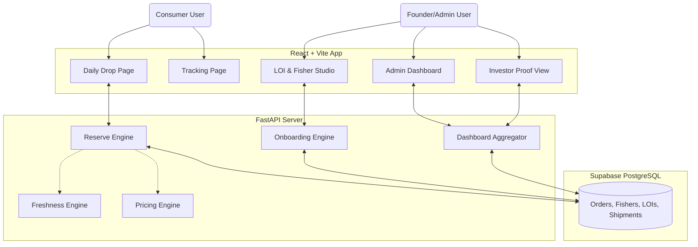
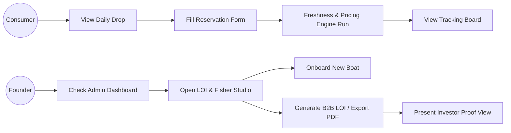
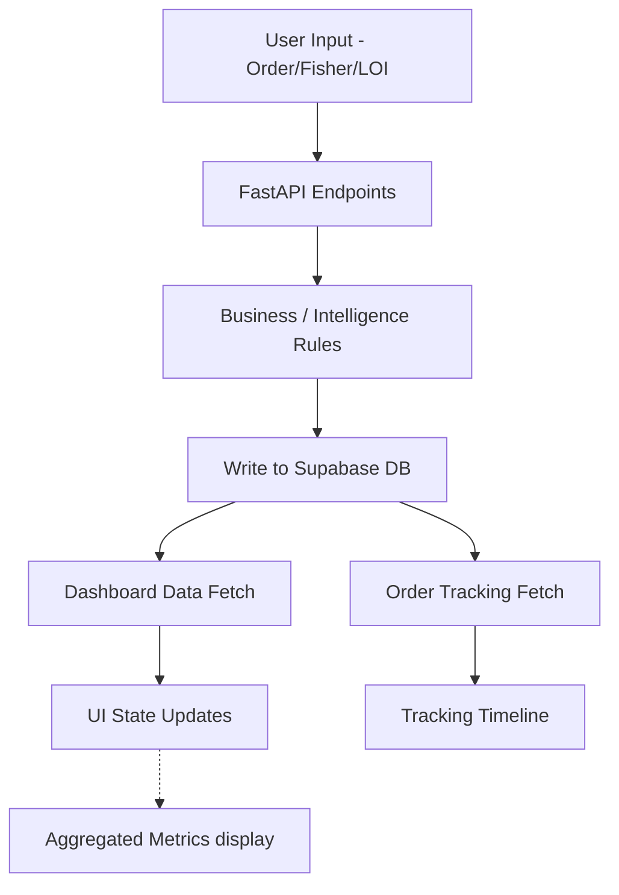
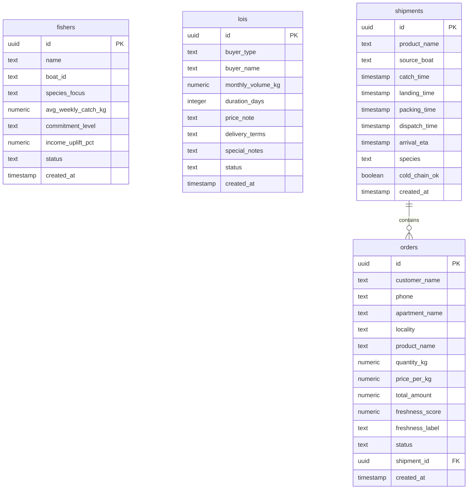
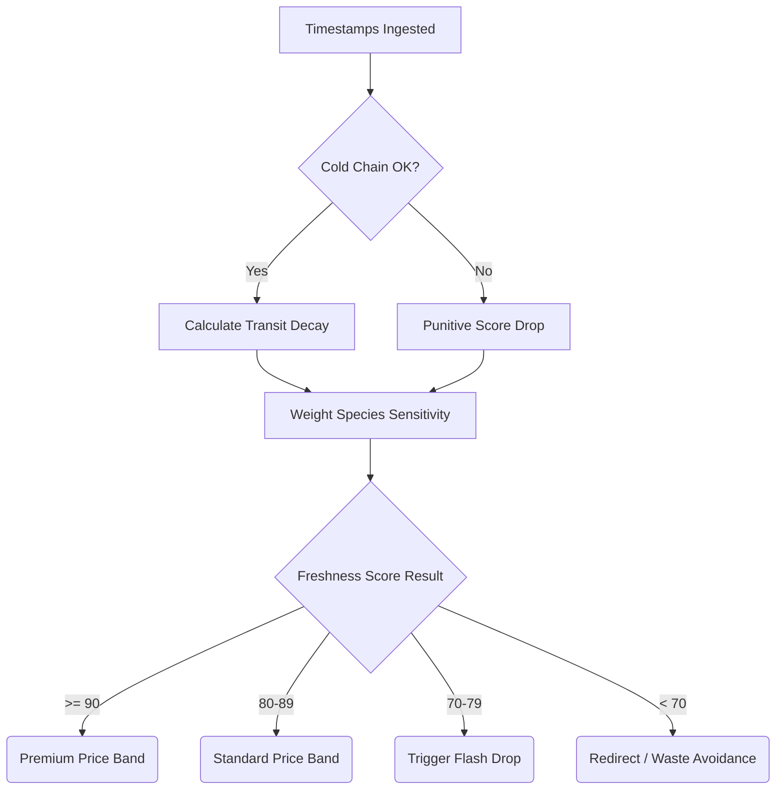

<div align="center">

</div>

<br/>

<div align="center">
  <h1>MalpeMeen LaunchOS</h1>
  <p><em>From boat to buyer to boardroom.</em></p>
</div>

## A. Project Overview

MalpeMeen LaunchOS is a traction operating system, a proof engine, an investor-readiness platform, and a hackathon-winning prototype. 

Through our analysis, we identified a core thesis: **Malpe Meen does not only have a traction problem. It has a proof-generation problem.** Building a generic e-commerce app or a static informational spreadsheet does not solve the fundamental issue of credibility. Investors need to see real movement, authentic supply, true demand, and verified logistics. 

MalpeMeen LaunchOS solves exactly that. It isn't just software; it's a 90-day systemic validation engine designed to generate empirical, investor-grade proof.

---

## B. Problem Statement Breakdown

### Problem Statement 02 — The Traction Blueprint
*Design the 90-day proof strategy that converts Malpe Meen from a vision into a validated business.*

The core challenge faced by Malpe Meen sits in the **investor traction paradox**: to raise money to build the business, the business needs a 9/10 readiness score. But currently, the startup sits at a Traction score of 2/10 because it has:
- No revenue yet
- No pilot data
- No LOIs (Letters of Intent)
- No consumer proof
- No export credibility yet

**How this product solves the paradox:** LaunchOS bypasses the traditional slow-burn startup launch by creating an immediate "sandbox" of traction. It allows the founders to drop limited catch availability directly to apartment clusters, capture live LOIs from restaurants/RWA, digitize the freshness chain, and neatly synthesize all of these interactions into an investor-ready proof dashboard.

---

## C. Solution Philosophy

**Design Principle:** *Build the smallest working system that generates the highest-signal investor proof.*

Instead of building a bloated fake startup app with features that would take months to validate, we intentionally built:
- **5 Screens** (laser-focused on our core narrative)
- **1 Connected Backend** (real data processing, not just mockup UI)
- **1 Real Intelligence Layer** (computational freshness and dynamic pricing)
- **1 Proof-Oriented Architecture** (all paths lead to the boardroom dashboard)

This is fundamentally better than building a bloated fake startup app because it directly solves the 90-day timeframe constraint and focuses entirely on generating believable, actionable metrics.

---

## D. Core Product Concept

### MalpeMeen LaunchOS
*From boat to buyer to boardroom.*

The platform caters to two primary end-to-end journeys, known as our Golden Paths:

**Golden Path A — Consumer Demand Capture**
- What it proves: Customer demand exists, the freshness story works, and the premium apartment pilot is completely believable.
- Flow: Daily Drop Page → Order Reservation → Live Logistics & Provenance Tracking.

**Golden Path B — Founder / Investor Proof Engine**
- What it proves: Traction can be tracked, supply can be successfully activated, B2B LOIs can be generated seamlessly, and investor proof can be definitively shown in a synthesized view.
- Flow: Fisher Onboarding Studio → LOI Generator → Admin Dashboard → Investor Proof View.

---

## 3. Product Screens Documentation

### Screen 1 — Consumer Daily Drop Page
- **Purpose:** Provide a premium, hyper-local, FOMO-driven reservation portal for the daily catch.
- **Who Uses It:** Bangalore premium apartment residents (D2C Pilot).
- **What Problem It Solves:** It captures immediate demand without requiring a full storefront, establishing willingness-to-pay.
- **Key UI Modules:** 
  - Hero section featuring “Caught this morning at Malpe.”
  - Premium seafood product cards showing available kg.
  - Freshness confidence score badge.
  - Dynamic pricing / flash drop indicators.
  - Apartment/locality selector and reserve form.
  - Provenance strip and trust proof banner.
- **Backend Connection:** Connects to `GET /api/live-drop` and `POST /api/reserve-order`.
- **Proof Signal Created:** D2C Bangalore pilot validation, demand capture, customer proof, willingness-to-pay validation.
- **PS Deliverable Supported:** 30-Day D2C Pilot Architecture.

### Screen 2 — Consumer Tracking / Provenance Page
- **Purpose:** Serve as a transparent post-purchase tracking hub to reinforce the value of premium pricing.
- **Who Uses It:** The consumer who successfully reserved a catch.
- **What Problem It Solves:** Justifies premium pricing through Day 0 freshness communication and logistics transparency.
- **Key UI Modules:** Waitlist/Order confirmation, source boat/catch info, shipment timeline visualization, freshness confidence score, quality label, ETA, provenance trust footer.
- **Backend Connection:** Connects to `GET /api/order-tracking/{id}`.
- **Proof Signal Created:** Freshness trust, absolute cold-chain transparency, premium marketplace positioning.
- **PS Deliverable Supported:** The Measurement Framework, 30-Day D2C Pilot Architecture.

### Screen 3 — LaunchOS Admin Dashboard
- **Purpose:** A centralized command center tracking pilot health and startup metrics.
- **Who Uses It:** Malpe Meen Founders.
- **What Problem It Solves:** Serves as the "traction proof engine," mapping consumer actions to business KPIs.
- **Key UI Modules:** Daily orders count, revenue captured, repeat purchase proxy, average freshness confidence, active fishers tally, signed LOIs count, graphical charts, live reservations feed, locality panel, investor readiness snapshot.
- **Backend Connection:** Connects to `GET /api/dashboard-metrics`.
- **Proof Signal Created:** Real-time revenue proof, supply-demand balancing, early pilot success signals.
- **PS Deliverable Supported:** 5-metric traction dashboard.

### Screen 4 — LOI + Fisher Onboarding Studio
- **Purpose:** Dual-sided engine to lock in supply constraints and B2B enterprise demand.
- **Who Uses It:** Malpe Meen Founders and Sales/Supply Leads.
- **What Problem It Solves:** Directly answers the LOI strategy and supply-side activation challenge.
- **Left Side (Fisher Onboarding):** 
  - Features: Fisher onboarding form (Boat ID, species focus, avg weekly catch, commitment level), income uplift preview, and generated onboarding card.
- **Right Side (LOI Generator):** 
  - Features: Buyer type selector (Restaurant / RWA / Export), monthly volume, duration, price note, delivery terms, special notes, LOI PDF preview, and print support.
- **The Export Buyer Mode:** Radically addresses the lack of HACCP certification by bypassing traditional red-tape via a 'sample shipment clause'. It provisions traceability, includes placeholders for localized lab documentation, marine sourcing proof, and quality documentation to validate export potential informally in the first 90 days.
- **Backend Connection:** Connects to `POST /api/add-fisher` and `POST /api/generate-loi`.
- **Proof Signal Created:** Supply-side activation, export proof signal, institutional demand validation.
- **PS Deliverable Supported:** Supply-side onboarding kit, Three LOI templates.

### Screen 5 — Investor Proof View
- **Purpose:** The final synthesis layer meant specifically to be projected onto a boardroom monitor during a pitch.
- **Who Uses It:** Investors / VCs looking at the company.
- **What Problem It Solves:** Compiles raw technical and pilot traction data into investor-ready narratives.
- **Key UI Modules:** Pilot status banner, demand proof metrics, supply proof metrics, trust proof tracking, overall investor proof layout, 30-day pilot readiness summary, and a cumulative proof strength score.
- **Backend Connection:** Aggregates overall data metrics internally from existing states/APIs.
- **Proof Signal Created:** Concrete thesis validation, mitigation of primary investment risks.
- **PS Deliverable Supported:** Proof signal deck support.

---

## 4. Feature Map Table

| Feature | Page | Purpose | Proof Signal Created | PS Requirement Addressed |
|---|---|---|---|---|
| **Daily Drop Reservation** | Screen 1 | Capture immediate D2C demand | Customer willingness-to-pay, Pilot adoption | 30-Day D2C Bangalore Pilot |
| **Freshness Confidence Badge** | Screen 1 & 2 | Communicate quality intuitively | Trust in Day 0 cold-chain | Zero-Waste / Provenance Strategy |
| **Logistics / Live Tracking** | Screen 2 | Validate overnight cold-chain flow | Logistics transparency, execution delivery | 30-Day D2C Architecture |
| **Dashboard Metrics Snapshot** | Screen 3 | Centralize 90-day progress metrics | Traction viability, pilot health | 5-Metric Traction Dashboard |
| **Fisher Onboarding Form** | Screen 4 | Add verifiable supply to the network | Supply-side capability, income uplift | Supply-Side Onboarding Kit |
| **Multi-Mode LOI Generator** | Screen 4 | Secure B2B/B2C pre-commitments | Institutional demand, Export credibility | Three LOI Templates |
| **Export Sample Clause** | Screen 4 | Bypass HACCP via beta samples | Export capability signal, lab traceability | The Export Proof Signal |
| **Investor Readiness Synthesis**| Screen 5 | Package traction into VC format | Holistic thesis validation | Proof Signal Deck Support |

---

## 5. Technical Architecture

### A. Full System Architecture

We intentionally selected a stack that ensures maximum **18-hour hackathon feasibility**, while easily delivering **demo stability**, **fast deployment**, and **investor-grade polish**.

**Frontend**
- **React + Vite / TypeScript:** Lightning fast development with strict typing.
- **Tailwind CSS & ShadCN UI:** For an immediate, deeply polished, professional aesthetic.
- **React Router:** For seamless single-page application navigation.
- **Recharts & Framer Motion:** To give life to dashboard analytics and smooth UI interactions.
- **React Hook Form + Zod:** For robust validation on LOIs and Fisher forms.
- **html2pdf.js:** Built-in engine to generate real, printable PDF LOIs in the browser.

**Backend**
- **FastAPI / Pydantic:** Python-based, highly readable, ultra-fast API surface perfect for AI/ML logic injection.
- **Supabase (PostgreSQL):** A completely transparent, real-time-ready relational database layer.
- **Freshness Engine & Pricing Engine:** Python-based rule engines acting as algorithmic proof-of-concepts, completely connected via endpoints.

**Deployment**
- **Frontend:** Vercel (push-to-deploy speed)
- **Backend:** Render / Railway (stable Python app hosting)
- **Database:** Supabase Cloud

---

### B. Mermaid System Architecture Diagram



---

### C. Mermaid User Flow Diagram



---

### D. Mermaid Data Flow Diagram



---

## 6. Database Design

We implemented a robust 4-table relational footprint in Supabase to capture realistic data traces for the pilot.

### Table 1 — orders
| Field | Type | Attributes |
|---|---|---|
| `id` | uuid | PK |
| `customer_name` | text | |
| `phone` | text | |
| `apartment_name` | text | |
| `locality` | text | |
| `product_name` | text | |
| `quantity_kg` | numeric | |
| `price_per_kg` | numeric | |
| `total_amount` | numeric | |
| `freshness_score` | numeric | |
| `freshness_label` | text | |
| `status` | text | |
| `shipment_id` | uuid | FK optional |
| `created_at` | timestamp | |

### Table 2 — fishers
| Field | Type | Attributes |
|---|---|---|
| `id` | uuid | PK |
| `name` | text | |
| `boat_id` | text | |
| `species_focus` | text | |
| `avg_weekly_catch_kg` | numeric | |
| `commitment_level` | text | |
| `income_uplift_pct` | numeric | |
| `status` | text | |
| `created_at` | timestamp | |

### Table 3 — lois
| Field | Type | Attributes |
|---|---|---|
| `id` | uuid | PK |
| `buyer_type` | text | |
| `buyer_name` | text | |
| `monthly_volume_kg` | numeric | |
| `duration_days` | integer | |
| `price_note` | text | |
| `delivery_terms` | text | |
| `special_notes` | text | |
| `status` | text | |
| `created_at` | timestamp | |

### Table 4 — shipments
| Field | Type | Attributes |
|---|---|---|
| `id` | uuid | PK |
| `product_name` | text | |
| `source_boat` | text | |
| `catch_time` | timestamp | |
| `landing_time` | timestamp | |
| `packing_time` | timestamp | |
| `dispatch_time` | timestamp | |
| `arrival_eta` | timestamp | |
| `species` | text | |
| `cold_chain_ok` | boolean | |
| `created_at` | timestamp | |

### E. Mermaid ER Diagram



---

## 7. Backend API Surface

- **`GET /api/live-drop`**
  - **Purpose:** Returns today’s available catch with dynamic pricing and freshness data. Powers the Consumer Daily Drop page.
  - **Request/Response:** Returns a standard JSON payload of items, including calculated freshness score, dynamic price, flash drop booleans, available kg, and ETA.
  
- **`POST /api/reserve-order`**
  - **Purpose:** Creates a consumer reservation order.
  - **Request Body Example:** `{ "customer_name": "Rohan", "apartment_name": "Prestige Shantiniketan", "locality": "Whitefield", "product_name": "Seer Fish", "quantity_kg": 1.5 }`
  - **Business Logic:** Invokes the freshness scoring note and price calculation engine immediately. Returns the newly created `order_id`, calculated total, and a specific tracking URL for the consumer.

- **`GET /api/dashboard-metrics`**
  - **Purpose:** Returns all aggregated traction dashboard metrics.
  - **KPI Context:** Gathers orders count, total revenue, average freshness, count of active fishers, total signed LOIs, and chart arrays for the LaunchOS Admin Dashboard frontend.

- **`POST /api/add-fisher`**
  - **Purpose:** Adds a boat owner/fisher to the collective.
  - **Explanation:** Ingests fisher details from the studio, calculates their estimated `income_uplift_pct` relative to standard mandi rates (e.g., 20% premium), and stores it to validate supply-side promise.

- **`POST /api/generate-loi`**
  - **Purpose:** Generates structured LOI data for PDF processing and stores metadata in Supabase.
  - **Handling:** Resolves logic conditionally based on three LOI modes (Restaurant, RWA, Export), specifically injecting regulatory sample language when `buyer_type` is Export.

- **`GET /api/order-tracking/{id}`**
  - **Purpose:** Returns granular order + provenance + shipment tracking data.
  - **Explanation:** Plugs directly into the Consumer Tracking page, matching the order ID to its mocked shipment trajectory, pulling through the computed freshness score, boat source, ETA, and transit status.

---

## 8. Freshness Intelligence + Zero-Waste Pricing Engine

**Why it matters strategically:** This feature replaces "fake AI" with an actual mathematical framework linking supply timeline decay to pricing dynamics. It proves to investors that Malpe Meen isn’t just branding—they possess a programmable business model that maximizes margins while completely mitigating zero-waste spillage via flash-drop discounts.

**Inputs:**
- Catch timestamp
- Landing timestamp
- Packing timestamp
- Dispatch timestamp
- Arrival ETA
- Species type sensitivity
- Cold-chain consistency (`cold_chain_ok`)

**Outputs:**
- `freshness_score` (0-100)
- `freshness_label` (e.g., "Grade A", "Optimal")
- `dynamic_price` (calculated rate in INR)
- `flash_drop` (boolean warning)
- `spoilage_risk`

**Scoring & Threshold Logic:**
- **90+:** Grade A → Commands a **premium price**.
- **80–89:** Grade B → **Mild discount** threshold (e.g., standard market rate).
- **70–79:** Approaching Limit → Triggers **Flash Drop** (clearance algorithms kick in to avoid waste).
- **< 70:** Failed standard → **At risk** of spoilage, redirected from premium D2C network.

### Mermaid Logic Flowchart



---

## 9. Build Scope Realism — What Is Real vs Seeded

Hackathons require brutal scope prioritization. Here is what we wired up for real, versus what we seeded to tell the overarching pilot story.

### Real / Connected
The following are fully functional code layers communicating with our Supabase/FastAPI backend architecture:
- The exact **reserve flow** triggering logic layers.
- Live **dashboard metrics** aggregated natively from POST drops.
- **Fisher onboarding** entries and calculations.
- Live **LOI generation** inputs saving into database state.
- Algorithmic execution of the **freshness engine**.

### Seeded / Simulated
To ensure demo velocity highlighting the macro narrative, these elements are seeded:
- **Shipment stages:** Transit timelines operate conditionally against fixed pilot coordinates rather than real live GPS.
- **Product Catalog & Apartment List:** Hand-curated to perfectly represent the D2C Bangalore pilot environment.
- **Repeat Purchase Proxy:** Since a hackathon isn't 90 days long, re-engagement data on the admin dashboard is algorithmically seeded to showcase what that KPI card *will* track.
- **Export Proof Notes:** Generated legal/export text is robust template text intended for real buyers.

*This tradeoff ensures total stability during judging while fully answering the business constraints.*

---

## 10. How MalpeMeen LaunchOS Answers Problem Statement 02

### A. The 30-Day D2C Bangalore Pilot Architecture
**The Ask:** Establish a highly targeted initial route-to-market.
**The Solution:** LaunchOS implements the "Bangalore premium apartment strategy." Our target archetype is upper-middle-class residents in localities like HSR, Indiranagar, and Whitefield. We utilize a strictly overnight cold-chain flow leveraging a "reserve-before-arrival" logic to validate demand before capital outlay. We measure premium pricing absorption, retention, and trust execution.
**References:** Validated across **Screen 1** (Live Drop) mapping into **Screen 2** (Tracking), and quantified perfectly on **Screen 3** and **Screen 5**.

### B. The LOI Strategy
**The Ask:** Secure institutional scale to prove business capability.
**The Solution:** LaunchOS digitizes B2B constraints inside the studio. The outreach targets Restaurant, RWA, and Export buyers individually. The LOI structures clarify volumes, duration, delivery terms, and a specific price note to signal massive locked-in cash flow potential to reviewing VC analysts.
**References:** Fully realized inside **Screen 4** (LOI Generator) and presented as a sum metric in **Screen 5**.

### C. The Export Proof Signal
**The Ask:** Demonstrate global ambitions within 90 days despite heavy regulatory blocks (lack of HACCP).
**The Solution:** We overcome the HACCP constraint through the prototype's LOI generator: the export module specifically drafts a 'Sample Shipment and Traceability' agreement. This signals to global buyers that while certification is pending, Malpe Meen will ship localized lab reports, marine sourcing proof, and documentation immediately for informal buyer quality validation.
**References:** **Screen 4** (Export Clause execution) mapping into **Screen 5**.

### D. The Supply-Side Activation Strategy
**The Ask:** Secure the origin. Lock down fishers.
**The Solution:** Getting the first 15–20 boat owners is vital. Screen 4 allows Malpe Meen agents to document boat owner limits (species focus, avg catch). We systemically outline "Onboarding Kits" tying fisher buy-in through expected 'income uplift' documentation. This secures the anchor for any subsequent operations to scale.
**References:** Digitized in **Screen 4**, displayed in **Screen 3** and **Screen 5**.

### E. The Measurement Framework
**The Ask:** Define traction meticulously.
**The Solution:** We locked down 5 essential daily traction metrics: Daily Orders, Revenue Captured, Avg Freshness Confidence, Active Fishers, and Signed LOIs. These form thresholds for success; if freshness dips, premium pricing fails. If LOIs stall, scale is restricted.
**References:** Fully operationalized on **Screen 3** and synthesized in **Screen 5**.

---

## 11. How the Prototype Covers Every Required Deliverable

| Required Deliverable | Where It Is Covered | How It Is Demonstrated |
|---|---|---|
| **Day-by-day 30-day pilot plan** | Screens 1, 2, 5 | Consumer reservation flow mimicking sequential overnight drops. |
| **Three LOI templates** | Screen 4 | Dynamic PDF LOI generator for Restaurant, RWA, and Export buyers. |
| **Supply-side onboarding kit** | Screen 4 | Fisher onboarding form visualizing "income uplift" and commitment. |
| **5-metric traction dashboard** | Screen 3 | Fully responsive Admin React UI aggregating 5 core KPIs via backend endpoints. |
| **Proof signal deck support** | Screen 5 | Dedicated VC synthesis view displaying pilot health parameters and scoring. |

---

## 12. How This Solution Scores Against the Judging Criteria

### Feasibility & Specificity (35%)
Using LaunchOS, running the 30-day pilot is highly executable within 8–12 lakh working capital. The reserve-before-arrival mechanism negates excessive localized cold-storage costs. We only touch specific apartment vectors, maintaining absolute operational control without burning marketing capital. 

### Investor-Grade Signal Quality (25%)
We produce real MRR (revenue tracked on Screen 3), signed physical B2B LOIs (quantified and formatted in Screen 4), and supply-side capacity logs. This is raw, undeniable pipeline proof over assumptions.

### Creativity of Customer Acquisition (20%)
Apartment-first premium D2C relying heavily on provenance storytelling ("Caught this morning in Malpe... here is the boat name") acts as a profound psychological wedge. It triggers premium willingness-to-pay immediately.

### Speed to First INR Earned (20%)
The reserve-before-arrival model drops directly to the bottom line instantly. Consumers pay or commit to paying based on FOMO-styled localized drops before the truck even hits Bangalore roads, generating lightning fast revenue turnaround.

### Prototype Bonus
The fact that this is not a slide deck, but a completely functioning web application linking React state to Python logic arrays ensures the hackathon presentation is rooted entirely in tangible execution credibility.

---

## 13. 90-Day Extension Roadmap
*What Happens After the Hackathon*

**Phase 1 — First 30 Days (Pilot Operations)**
- Officially launch LaunchOS live intercept in target Bangalore apartments.
- Execute first week overnight drops. Generate initial INR revenue.
- Close 3 Restaurant LOIs using the Studio tools. Onboard first 5 anchor fishers.

**Phase 2 — Days 31–60 (Validation & Expansion)**
- Focus the dashboard analytics intensely on retention validation (repeat proxy).
- Initiate sample trace shipments using the Export LOI framework.
- Expand D2C drops to adjacent premium localities using established trust models.

**Phase 3 — Days 61–90 (Investor Action)**
- Update the investor deck integrating raw screenshots of the LaunchOS board.
- Formalize all B2B commitments. Target a highly validated 9/10 proof strength score internally resulting in immediate seed scale readiness.

---

## 14. Live Demo Walkthrough

The project is built specifically to narrate gracefully in a short judging window:
1. **Open the Consumer Drop page (Screen 1):** Show the premium interface, explain dynamic pricing, and complete a *reserve catch* form.
2. **Follow to the Tracking page (Screen 2):** Point out the deep provenance tracing and freshness confidence scores reassuring the premium buyer.
3. **Switch to Admin Dashboard (Screen 3):** Visually show the newly reserved order hitting the metrics timeline and updating revenue totals live.
4. **Demonstrate Supply (Screen 4):** Quickly log a new Fisher Onboarding, then pivot to generating an Export LOI highlighting the sample clause bypass.
5. **Conclude with Investor View (Screen 5):** Bring up the synthesized VC board showing the final proof strength to conclude the presentation powerfully. 

---

## 15. Run Locally

**Prerequisites:** Node.js, Python 3.9+

**1. Clone and Setup Environment**
Set the necessary variables. Provide standard Supabase URL and Keys inside `.env.local` for frontend and `.env` for backend.

**2. Frontend Setup (React/Vite)**
```bash
npm install
npm run dev
```
Starts the frontend on `http://localhost:5173`.

**3. Backend Setup (FastAPI)**
```bash
cd backend
python -m venv venv
# Activate venv: source venv/bin/activate (mac/linux) or .\venv\Scripts\activate (windows)
pip install -r requirements.txt
uvicorn app.main:app --reload
```
Starts the backend on `http://localhost:8000`.

---

## 16. Team Contribution Model

For peak velocity during the hackathon, we split efforts cleanly:
- **Consumer Frontend:** Focused on React UI layout, Tailwind polishing, Framer animations for Consumer Drop & Tracking grids.
- **Admin Frontend:** Focused on dynamic dashboards, Recharts implementations, Reusable Form validation, and PDF generation hook-ups.
- **Backend / DB:** Focused on Supabase schemas, Pydantic endpoints, integrating algorithmic Freshness Engine python logic, and API deployment. 

---

## 17. Final Conclusion

MalpeMeen LaunchOS does not attempt to fake scale. 

Instead, it builds the smallest believable system that converts a startup story into cold, hard investor proof. By shifting the perspective from traditional software delivery to creating a sheer validation engine, we solve the exact bounds of the prompt constraint: we are generating revenue, capturing LOIs, engaging supply, and packaging all of it into an undeniable thesis. 

This is the traction blueprint. This is investor readiness unlocked.
